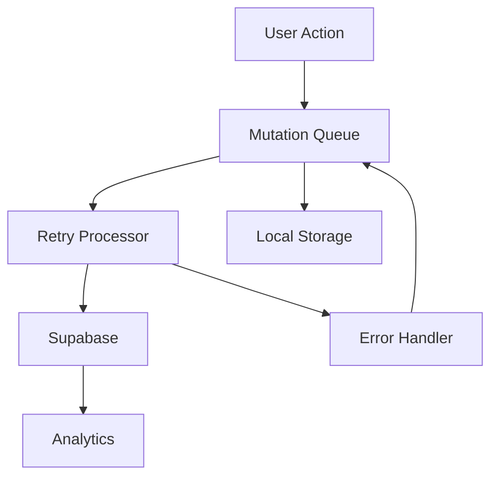

# CareAI Mutation Queue System

## Overview

The mutation queue system in CareAI provides robust offline support and data synchronization capabilities. It ensures that user actions are reliably persisted even in unstable network conditions.

## Architecture



## Code Examples

### 1. Adding a Mutation to the Queue

```typescript
import { useMutationQueue } from '@/hooks/useMutationQueue';

// In your component:
const { addMutation } = useMutationQueue();

// Add a medication reminder mutation
const addMedicationReminder = async (medicationData) => {
  await addMutation({
    type: 'ADD_MEDICATION_REMINDER',
    payload: medicationData,
    optimisticUpdate: (store) => {
      // Update local state immediately
      store.medications.push({
        ...medicationData,
        id: 'temp-' + Date.now(),
        status: 'pending'
      });
    }
  });
};
```

### 2. Performing an Optimistic Update

```typescript
const updateUserProfile = async (profileData) => {
  await addMutation({
    type: 'UPDATE_USER_PROFILE',
    payload: profileData,
    optimisticUpdate: (store) => {
      // Update UI immediately
      store.userProfile = {
        ...store.userProfile,
        ...profileData
      };
    },
    rollback: (store) => {
      // Revert changes if mutation fails
      store.userProfile = store.userProfileBackup;
    }
  });
};
```

### 3. Handling Retry Outcomes

```typescript
const { addMutation, onRetryComplete } = useMutationQueue();

// Listen for retry completion
onRetryComplete((result) => {
  if (result.success) {
    // Handle successful retry
    showSuccessToast('Changes saved successfully');
  } else {
    // Handle failed retry
    showErrorToast('Failed to save changes. Will retry later.');
  }
});

// Add mutation with retry handling
const syncHealthData = async (healthData) => {
  await addMutation({
    type: 'SYNC_HEALTH_DATA',
    payload: healthData,
    maxRetries: 3,
    retryDelay: 5000, // 5 seconds
    onRetry: (attempt) => {
      console.log(`Retry attempt ${attempt} for health data sync`);
    }
  });
};
```

### 4. Using Admin Queue Controls

```typescript
import { useAdminQueueControls } from '@/hooks/useAdminQueueControls';

const AdminQueuePanel = () => {
  const {
    clearQueue,
    retryFailed,
    pauseQueue,
    resumeQueue,
    getQueueStatus
  } = useAdminQueueControls();

  // Force retry all failed mutations
  const handleRetryAll = async () => {
    await retryFailed();
  };

  // Get current queue status
  const checkQueueStatus = async () => {
    const status = await getQueueStatus();
    console.log('Queue status:', status);
  };
};
```

## Troubleshooting Guide

### Common Issues and Solutions

#### 1. "Why isn't a mutation being retried?"

**Possible Causes:**
- Mutation has exceeded max retry attempts
- Network is still offline
- Queue is paused
- Mutation is marked as "do not retry"

**Solutions:**
```typescript
// Check mutation status
const { getMutationStatus } = useMutationQueue();
const status = await getMutationStatus(mutationId);

// Force retry specific mutation
const { forceRetry } = useAdminQueueControls();
await forceRetry(mutationId);
```

#### 2. "How to force retry if mutation is stuck?"

```typescript
// Using admin controls
const { forceRetry, clearStuckMutations } = useAdminQueueControls();

// Force retry specific mutation
await forceRetry(mutationId);

// Clear all stuck mutations
await clearStuckMutations();
```

#### 3. "Why does the queue not clear after network recovery?"

**Possible Causes:**
- Queue processor is not running
- Mutations are failing validation
- Backend is rejecting mutations

**Solutions:**
```typescript
// Check queue processor status
const { getQueueStatus } = useAdminQueueControls();
const status = await getQueueStatus();

// Restart queue processor
const { restartQueue } = useAdminQueueControls();
await restartQueue();
```

#### 4. "How to debug specific error categories?"

```typescript
// Enable detailed logging
const { enableDebugLogging } = useAdminQueueControls();
enableDebugLogging();

// Monitor specific error types
const { onError } = useMutationQueue();
onError((error) => {
  if (error.type === 'VALIDATION_ERROR') {
    console.log('Validation error:', error.details);
  } else if (error.type === 'NETWORK_ERROR') {
    console.log('Network error:', error.details);
  }
});
```

## Security & Performance

### Persistence Encryption

The mutation queue uses MMKV for secure storage:
```typescript
import { MMKV } from 'react-native-mmkv';

const storage = new MMKV({
  id: 'mutation-queue',
  encryptionKey: 'your-encryption-key'
});
```

### Safe Mutation Structure

```typescript
interface Mutation {
  id: string;
  type: string;
  payload: any;
  timestamp: number;
  retryCount: number;
  status: 'pending' | 'processing' | 'completed' | 'failed';
  // No sensitive data in payload
  metadata?: {
    userId: string;
    deviceId: string;
    appVersion: string;
  };
}
```

### Retry Throttling

```typescript
const retryConfig = {
  baseDelay: 1000, // 1 second
  maxDelay: 30000, // 30 seconds
  maxRetries: 5,
  backoffFactor: 2
};
```

## Best Practices

1. **Always use optimistic updates** for better UX
2. **Implement proper rollback** for failed mutations
3. **Keep payloads small** and free of sensitive data
4. **Use appropriate retry strategies** based on mutation type
5. **Monitor queue health** in production

## Production Checklist

### Queue Persistence Verification
```typescript
// Test queue persistence across app restarts
const verifyQueuePersistence = async () => {
  // Add test mutation
  await addMutation({
    type: 'TEST_PERSISTENCE',
    payload: { timestamp: Date.now() }
  });

  // Force app restart
  await restartApp();

  // Verify mutation still exists
  const { getQueueStatus } = useAdminQueueControls();
  const status = await getQueueStatus();
  return status.pendingMutations.length > 0;
};
```

### Retry Processor Testing
```typescript
// Test different failure modes
const testRetryScenarios = async () => {
  // Network timeout
  await addMutation({
    type: 'TEST_TIMEOUT',
    payload: { delay: 30000 }
  });

  // Server error
  await addMutation({
    type: 'TEST_SERVER_ERROR',
    payload: { statusCode: 500 }
  });

  // Validation error
  await addMutation({
    type: 'TEST_VALIDATION',
    payload: { invalid: true }
  });
};
```

### Supabase Rejection Testing
```typescript
// Test various rejection scenarios
const testSupabaseRejections = async () => {
  // Rate limit
  await addMutation({
    type: 'TEST_RATE_LIMIT',
    payload: { requests: 100 }
  });

  // Authentication
  await addMutation({
    type: 'TEST_AUTH',
    payload: { token: 'expired' }
  });

  // Data validation
  await addMutation({
    type: 'TEST_DATA_VALIDATION',
    payload: { required: null }
  });
};
```

### Queue Size Management
```typescript
// Implement queue size monitoring
const QUEUE_SIZE_LIMIT = 1000;

const monitorQueueSize = async () => {
  const { getQueueStatus } = useAdminQueueControls();
  const status = await getQueueStatus();
  
  if (status.totalMutations > QUEUE_SIZE_LIMIT) {
    // Alert administrators
    await notifyAdmins('Queue size exceeded limit');
    
    // Implement cleanup strategy
    await cleanupOldMutations();
  }
};
```

### Admin Panel Testing
```typescript
// Test admin controls across platforms
const testAdminControls = async () => {
  const controls = [
    { action: 'pauseQueue', platform: 'mobile' },
    { action: 'resumeQueue', platform: 'desktop' },
    { action: 'clearQueue', platform: 'mobile' },
    { action: 'retryFailed', platform: 'desktop' }
  ];

  for (const test of controls) {
    await testAdminAction(test.action, test.platform);
  }
};
```

## Migration Strategy

### Schema Versioning
```typescript
interface MutationV1 {
  id: string;
  type: string;
  payload: any;
  timestamp: number;
}

interface MutationV2 {
  id: string;
  type: string;
  payload: any;
  timestamp: number;
  version: '2.0';
  metadata: {
    deviceId: string;
    appVersion: string;
  };
}
```

### Migration Process
```typescript
// Handle migration of queued mutations
const migrateQueuedMutations = async () => {
  const storage = new MMKV({ id: 'mutation-queue' });
  const mutations = storage.getString('queue');
  
  if (mutations) {
    const parsed = JSON.parse(mutations);
    const migrated = parsed.map(migrateMutation);
    storage.set('queue', JSON.stringify(migrated));
  }
};

// Migration helper
const migrateMutation = (mutation: MutationV1): MutationV2 => ({
  ...mutation,
  version: '2.0',
  metadata: {
    deviceId: getDeviceId(),
    appVersion: getAppVersion()
  }
});
```

### Version Detection
```typescript
// Skip outdated mutations
const processMutation = async (mutation: MutationV1 | MutationV2) => {
  if (!mutation.version || mutation.version < '2.0') {
    console.log('Skipping outdated mutation:', mutation.id);
    return;
  }
  
  // Process current version mutation
  await executeMutation(mutation);
};
```

## Audit Logging Integration

### Retry Attempt Logging
```typescript
interface RetryLog {
  mutationId: string;
  attempt: number;
  timestamp: number;
  outcome: 'success' | 'failure';
  error?: string;
  adminUser?: string;
}

// Log retry attempts
const logRetryAttempt = async (mutationId: string, attempt: number, outcome: 'success' | 'failure', error?: string) => {
  const log: RetryLog = {
    mutationId,
    attempt,
    timestamp: Date.now(),
    outcome,
    error
  };

  await supabase
    .from('mutation_retry_logs')
    .insert(log);
};
```

### Admin Action Logging
```typescript
interface AdminActionLog {
  adminId: string;
  action: 'retry' | 'clear' | 'pause' | 'resume';
  mutationId?: string;
  timestamp: number;
  details: any;
}

// Log admin actions
const logAdminAction = async (adminId: string, action: string, mutationId?: string, details?: any) => {
  const log: AdminActionLog = {
    adminId,
    action,
    mutationId,
    timestamp: Date.now(),
    details
  };

  await supabase
    .from('admin_action_logs')
    .insert(log);
};
```

### Log Export
```typescript
// Export logs for analysis
const exportAuditLogs = async (startDate: Date, endDate: Date) => {
  const { data: retryLogs } = await supabase
    .from('mutation_retry_logs')
    .select('*')
    .gte('timestamp', startDate.getTime())
    .lte('timestamp', endDate.getTime());

  const { data: adminLogs } = await supabase
    .from('admin_action_logs')
    .select('*')
    .gte('timestamp', startDate.getTime())
    .lte('timestamp', endDate.getTime());

  return {
    retryLogs,
    adminLogs,
    exportDate: new Date(),
    format: 'json'
  };
};
```

### Log Monitoring
```typescript
// Monitor retry patterns
const monitorRetryPatterns = async () => {
  const { data: patterns } = await supabase
    .from('mutation_retry_logs')
    .select('mutationId, count(*)')
    .group('mutationId')
    .gte('count', 5);

  // Alert on excessive retries
  if (patterns.length > 0) {
    await notifyAdmins('Excessive retries detected', patterns);
  }
};
```

## Test Suite

### Unit Tests
```typescript
// test/mutationQueue.test.ts
import { MutationQueue } from '@/lib/mutationQueue';
import { mockSupabase } from '@/test/mocks/supabase';

describe('MutationQueue', () => {
  let queue: MutationQueue;

  beforeEach(() => {
    queue = new MutationQueue(mockSupabase);
  });

  test('should add mutation to queue', async () => {
    const mutation = {
      type: 'TEST_MUTATION',
      payload: { test: true }
    };

    await queue.add(mutation);
    const status = await queue.getStatus();
    expect(status.pendingMutations).toHaveLength(1);
  });

  test('should retry failed mutation', async () => {
    const mutation = await queue.add({
      type: 'FAILING_MUTATION',
      payload: { willFail: true }
    });

    await queue.retry(mutation.id);
    const status = await queue.getStatus();
    expect(status.retryCount).toBe(1);
  });

  test('should remove completed mutation', async () => {
    const mutation = await queue.add({
      type: 'SUCCESS_MUTATION',
      payload: { willSucceed: true }
    });

    await queue.process();
    await queue.remove(mutation.id);
    const status = await queue.getStatus();
    expect(status.completedMutations).toHaveLength(0);
  });
});
```

### Integration Tests
```typescript
// test/integration/mutationQueue.integration.test.ts
import { MutationQueue } from '@/lib/mutationQueue';
import { NetworkSimulator } from '@/test/utils/networkSimulator';
import { SupabaseSimulator } from '@/test/utils/supabaseSimulator';

describe('MutationQueue Integration', () => {
  let queue: MutationQueue;
  let network: NetworkSimulator;
  let supabase: SupabaseSimulator;

  beforeEach(() => {
    network = new NetworkSimulator();
    supabase = new SupabaseSimulator();
    queue = new MutationQueue(supabase);
  });

  test('should handle offline to online transition', async () => {
    // Start offline
    network.setOffline();
    
    // Add mutation while offline
    const mutation = await queue.add({
      type: 'OFFLINE_MUTATION',
      payload: { data: 'test' }
    });
    
    // Verify queued
    expect(await queue.getStatus()).toHaveProperty('pendingMutations.length', 1);
    
    // Go online
    network.setOnline();
    
    // Wait for processing
    await queue.process();
    
    // Verify completed
    expect(await queue.getStatus()).toHaveProperty('completedMutations.length', 1);
  });

  test('should handle admin retry flow', async () => {
    // Add failing mutation
    const mutation = await queue.add({
      type: 'FAILING_MUTATION',
      payload: { willFail: true }
    });
    
    // Simulate failure
    supabase.setErrorMode(true);
    await queue.process();
    
    // Admin retry
    await queue.adminRetry(mutation.id);
    
    // Simulate success
    supabase.setErrorMode(false);
    await queue.process();
    
    // Verify success
    const status = await queue.getStatus();
    expect(status.completedMutations).toContainEqual(
      expect.objectContaining({ id: mutation.id })
    );
  });
});
```

## Metrics API

### API Endpoint
```typescript
// api/mutation-metrics.ts
import { Router } from 'express';
import { MutationQueue } from '@/lib/mutationQueue';

const router = Router();

// Get current queue metrics
router.get('/metrics', async (req, res) => {
  const queue = new MutationQueue();
  const metrics = await queue.getMetrics();
  
  res.json({
    timestamp: Date.now(),
    metrics: {
      queueSize: metrics.totalMutations,
      pendingCount: metrics.pendingMutations.length,
      completedCount: metrics.completedMutations.length,
      failedCount: metrics.failedMutations.length,
      averageRetryCount: metrics.averageRetries,
      successRate: metrics.successRate,
      processingTime: metrics.averageProcessingTime
    }
  });
});

// Get historical metrics
router.get('/metrics/history', async (req, res) => {
  const { startDate, endDate } = req.query;
  const metrics = await getHistoricalMetrics(startDate, endDate);
  
  res.json(metrics);
});

export default router;
```

### Dashboard Integration
```typescript
// lib/metrics/dashboard.ts
import { GrafanaClient } from '@/lib/grafana';
import { MetabaseClient } from '@/lib/metabase';

export class MetricsDashboard {
  private grafana: GrafanaClient;
  private metabase: MetabaseClient;

  constructor() {
    this.grafana = new GrafanaClient();
    this.metabase = new MetabaseClient();
  }

  async updateMetrics(metrics: QueueMetrics) {
    // Update Grafana
    await this.grafana.pushMetrics({
      series: [{
        name: 'mutation_queue_size',
        value: metrics.queueSize,
        timestamp: Date.now()
      }]
    });

    // Update Metabase
    await this.metabase.updateDashboard({
      metrics: {
        queueSize: metrics.queueSize,
        successRate: metrics.successRate
      }
    });
  }

  async setupAlerts() {
    // Configure Grafana alerts
    await this.grafana.setupAlert({
      name: 'queue_size_alert',
      condition: 'queue_size > 1000',
      notification: {
        type: 'slack',
        channel: '#alerts-mutation-queue'
      }
    });
  }
}
```

## Documentation Integration

### Notion Integration
```typescript
// scripts/notion-sync.ts
import { NotionClient } from '@/lib/notion';
import { readMarkdown } from '@/lib/markdown';

async function syncToNotion() {
  const notion = new NotionClient();
  const docs = readMarkdown('Docs/mutation-queue/README.md');
  
  // Create or update Notion page
  await notion.updatePage({
    title: 'Mutation Queue System',
    content: docs,
    tags: ['technical', 'documentation', 'mutation-queue'],
    lastUpdated: new Date()
  });
}

// Run sync
syncToNotion();
```

### GitHub Wiki Integration
```typescript
// scripts/wiki-sync.ts
import { GitHubClient } from '@/lib/github';
import { readMarkdown } from '@/lib/markdown';

async function syncToWiki() {
  const github = new GitHubClient();
  const docs = readMarkdown('Docs/mutation-queue/README.md');
  
  // Update wiki page
  await github.updateWikiPage({
    title: 'Mutation-Queue-System',
    content: docs,
    commitMessage: 'Update mutation queue documentation'
  });
}

// Run sync
syncToWiki();
```

### Admin Dashboard Integration
```typescript
// components/AdminDashboard.tsx
import { useMutationQueueDocs } from '@/hooks/useMutationQueueDocs';

const AdminDashboard = () => {
  const { docs, isLoading } = useMutationQueueDocs();

  return (
    <div>
      <h1>Mutation Queue Administration</h1>
      
      {/* Documentation Section */}
      <section>
        <h2>Documentation</h2>
        {isLoading ? (
          <LoadingSpinner />
        ) : (
          <DocumentationViewer
            sections={docs.sections}
            onSectionClick={(section) => {
              // Navigate to specific section
              navigateToSection(section.id);
            }}
          />
        )}
      </section>

      {/* Metrics Section */}
      <section>
        <h2>Queue Metrics</h2>
        <MetricsDashboard />
      </section>

      {/* Controls Section */}
      <section>
        <h2>Queue Controls</h2>
        <QueueControls />
      </section>
    </div>
  );
};
```

## Related Documentation

- [Architecture Overview](../architecture/README.md)
- [Offline Support](../performance/offline.md)
- [Security Guidelines](../security/README.md)
- [Performance Optimization](../performance/README.md)

## Advanced Test Cases

### Rate Limit Handling
```typescript
// test/mutationQueue.rateLimit.test.ts
describe('Rate Limit Handling', () => {
  test('should handle Supabase 429 errors', async () => {
    const queue = new MutationQueue();
    
    // Simulate rate limit
    mockSupabase.setRateLimit(true);
    
    // Add multiple mutations
    const mutations = await Promise.all(
      Array(10).fill(null).map(() => 
        queue.add({ type: 'TEST_MUTATION', payload: {} })
      )
    );
    
    // Verify backoff behavior
    const status = await queue.getStatus();
    expect(status.retryDelays).toHaveLength(10);
    expect(status.retryDelays[0]).toBeLessThan(status.retryDelays[9]);
  });

  test('should respect rate limit headers', async () => {
    const queue = new MutationQueue();
    
    // Mock rate limit response
    mockSupabase.setRateLimitResponse({
      'Retry-After': '5',
      'X-RateLimit-Remaining': '0'
    });
    
    await queue.process();
    
    // Verify queue respects retry delay
    const nextRetry = await queue.getNextRetryTime();
    expect(nextRetry).toBeGreaterThan(Date.now() + 4000);
  });
});
```

### Queue Corruption Recovery
```typescript
// test/mutationQueue.recovery.test.ts
describe('Queue Recovery', () => {
  test('should recover from corrupted payload', async () => {
    const queue = new MutationQueue();
    
    // Inject corrupted mutation
    await queue.storage.set('queue', JSON.stringify([
      { id: '1', type: 'TEST', payload: null },
      { id: '2', type: 'TEST', payload: undefined },
      { id: '3', type: 'TEST', payload: 'invalid' }
    ]));
    
    // Attempt recovery
    await queue.recover();
    
    // Verify valid mutations preserved
    const status = await queue.getStatus();
    expect(status.corruptedMutations).toHaveLength(3);
    expect(status.validMutations).toHaveLength(0);
  });

  test('should handle invalid mutation structure', async () => {
    const queue = new MutationQueue();
    
    // Add mutation with missing required fields
    await queue.storage.set('queue', JSON.stringify([
      { id: '1' }, // Missing type and payload
      { type: 'TEST' }, // Missing id and payload
      { payload: {} } // Missing id and type
    ]));
    
    // Attempt recovery
    await queue.recover();
    
    // Verify recovery actions
    const status = await queue.getStatus();
    expect(status.recoveryActions).toContainEqual({
      action: 'REMOVE_INVALID',
      count: 3
    });
  });
});
```

### Mutation Deduplication
```typescript
// test/mutationQueue.deduplication.test.ts
describe('Mutation Deduplication', () => {
  test('should deduplicate identical mutations', async () => {
    const queue = new MutationQueue();
    
    // Add duplicate mutations
    const mutation = {
      type: 'UPDATE_PROFILE',
      payload: { name: 'John' }
    };
    
    await queue.add(mutation);
    await queue.add(mutation);
    
    // Verify deduplication
    const status = await queue.getStatus();
    expect(status.pendingMutations).toHaveLength(1);
  });

  test('should handle concurrent deduplication', async () => {
    const queue = new MutationQueue();
    
    // Simulate concurrent adds
    await Promise.all([
      queue.add({ type: 'TEST', payload: { id: 1 } }),
      queue.add({ type: 'TEST', payload: { id: 1 } }),
      queue.add({ type: 'TEST', payload: { id: 1 } })
    ]);
    
    // Verify only one mutation added
    const status = await queue.getStatus();
    expect(status.pendingMutations).toHaveLength(1);
  });
});
```

### Admin Interrupt Handling
```typescript
// test/mutationQueue.interrupt.test.ts
describe('Admin Interrupt Handling', () => {
  test('should handle queue pause during flush', async () => {
    const queue = new MutationQueue();
    
    // Add multiple mutations
    await Promise.all(
      Array(5).fill(null).map(() => 
        queue.add({ type: 'TEST', payload: {} })
      )
    );
    
    // Start processing
    const processPromise = queue.process();
    
    // Simulate admin pause
    await queue.pause();
    
    // Verify clean pause
    const status = await queue.getStatus();
    expect(status.isPaused).toBe(true);
    expect(status.processingMutations).toHaveLength(0);
  });

  test('should resume from interrupted state', async () => {
    const queue = new MutationQueue();
    
    // Add mutations and start processing
    await queue.add({ type: 'TEST', payload: {} });
    const processPromise = queue.process();
    
    // Interrupt and resume
    await queue.pause();
    await queue.resume();
    
    // Verify processing continues
    const status = await queue.getStatus();
    expect(status.isPaused).toBe(false);
    expect(status.processingMutations).toHaveLength(1);
  });
});
```

## Expanded Metrics API

### Error Insights Endpoint
```typescript
// api/mutation-metrics/errors.ts
router.get('/errors', async (req, res) => {
  const { timeRange, type, status } = req.query;
  const errors = await getErrorInsights({
    timeRange,
    type,
    status
  });
  
  res.json({
    timestamp: Date.now(),
    errors: {
      byType: errors.groupedByType,
      byStatus: errors.groupedByStatus,
      byTime: errors.groupedByTime,
      topErrors: errors.mostFrequent,
      recentErrors: errors.recent
    }
  });
});
```

### Throughput Metrics
```typescript
// api/mutation-metrics/throughput.ts
router.get('/throughput', async (req, res) => {
  const { timeRange, type } = req.query;
  const throughput = await getThroughputMetrics({
    timeRange,
    type
  });
  
  res.json({
    timestamp: Date.now(),
    throughput: {
      rate: throughput.mutationsPerSecond,
      growth: throughput.queueGrowthRate,
      processing: throughput.processingRate,
      backlog: throughput.backlogSize
    }
  });
});
```

### Webhook Integration
```typescript
// lib/metrics/webhooks.ts
export class MetricsWebhook {
  async sendAlert(alert: Alert) {
    // Send to Slack
    await this.slack.send({
      channel: '#alerts-mutation-queue',
      text: this.formatAlertMessage(alert)
    });
    
    // Send to Opsgenie
    await this.opsgenie.createAlert({
      message: alert.message,
      priority: alert.priority,
      details: alert.metrics
    });
  }
  
  private formatAlertMessage(alert: Alert): string {
    return `
🚨 Mutation Queue Alert
Message: ${alert.message}
Priority: ${alert.priority}
Metrics:
${Object.entries(alert.metrics)
  .map(([key, value]) => `- ${key}: ${value}`)
  .join('\n')}
    `.trim();
  }
}
```

## Enhanced Admin Dashboard

### Mutation History Timeline
```typescript
// components/MutationTimeline.tsx
const MutationTimeline = () => {
  const { mutations, filters, setFilters } = useMutationHistory();
  
  return (
    <div className="mutation-timeline">
      <TimelineFilters
        filters={filters}
        onChange={setFilters}
      />
      
      <TimelineView
        data={mutations}
        renderItem={(mutation) => (
          <TimelineItem
            key={mutation.id}
            type={mutation.type}
            status={mutation.status}
            timestamp={mutation.timestamp}
            steps={mutation.steps}
          />
        )}
      />
    </div>
  );
};
```

### Live Log Stream
```typescript
// components/LogStream.tsx
const LogStream = () => {
  const { logs, isConnected } = useLogStream();
  
  return (
    <div className="log-stream">
      <ConnectionStatus connected={isConnected} />
      
      <LogViewer
        logs={logs}
        autoScroll={true}
        highlightPatterns={[
          { pattern: /error/i, color: 'red' },
          { pattern: /warning/i, color: 'yellow' },
          { pattern: /success/i, color: 'green' }
        ]}
      />
      
      <LogControls
        onClear={() => clearLogs()}
        onExport={() => exportLogs()}
        onFilter={(filter) => setLogFilter(filter)}
      />
    </div>
  );
};
```

### Alert Settings Panel
```typescript
// components/AlertSettings.tsx
const AlertSettings = () => {
  const { settings, updateSettings } = useAlertSettings();
  
  return (
    <div className="alert-settings">
      <ThresholdSettings
        thresholds={settings.thresholds}
        onChange={(thresholds) => 
          updateSettings({ ...settings, thresholds })
        }
      />
      
      <NotificationSettings
        channels={settings.notifications}
        onToggle={(channel) => 
          updateSettings({
            ...settings,
            notifications: {
              ...settings.notifications,
              [channel]: !settings.notifications[channel]
            }
          })
        }
      />
      
      <MuteSettings
        mutedAlerts={settings.muted}
        onMute={(alertId) => 
          updateSettings({
            ...settings,
            muted: [...settings.muted, alertId]
          })
        }
        onUnmute={(alertId) =>
          updateSettings({
            ...settings,
            muted: settings.muted.filter(id => id !== alertId)
          })
        }
      />
    </div>
  );
};
```

## Related Documentation

- [Architecture Overview](../architecture/README.md)
- [Offline Support](../performance/offline.md)
- [Security Guidelines](../security/README.md)
- [Performance Optimization](../performance/README.md)

## System Readiness

### System Readiness Report
```typescript
// scripts/generate-readiness-report.ts
async function generateReadinessReport() {
  const report = {
    timestamp: new Date(),
    queueStatus: await getQueueStatus(),
    testCoverage: await getTestCoverage(),
    errorStats: await getErrorStats(),
    retryStats: await getRetryStats()
  };

  return `
# Mutation Queue System Readiness Report
Generated: ${report.timestamp}

## Queue Status
- Total Mutations: ${report.queueStatus.totalMutations}
- Pending: ${report.queueStatus.pendingMutations.length}
- Processing: ${report.queueStatus.processingMutations.length}
- Completed: ${report.queueStatus.completedMutations.length}
- Failed: ${report.queueStatus.failedMutations.length}

## Test Coverage
- Unit Tests: ${report.testCoverage.unit}%
- Integration Tests: ${report.testCoverage.integration}%
- E2E Tests: ${report.testCoverage.e2e}%
- Critical Paths: ${report.testCoverage.criticalPaths}%

## Error Statistics
${Object.entries(report.errorStats)
  .map(([type, count]) => `- ${type}: ${count}`)
  .join('\n')}

## Retry Statistics
- Average Retries: ${report.retryStats.averageRetries}
- Max Retries: ${report.retryStats.maxRetries}
- Success Rate: ${report.retryStats.successRate}%
- Recovery Rate: ${report.retryStats.recoveryRate}%
  `.trim();
}
```

### Quick Start Guide
```typescript
// scripts/quick-start.ts
async function setupMutationQueue() {
  // 1. Initialize Supabase tables
  await supabase.createTable('mutation_queue', {
    id: 'uuid',
    type: 'text',
    payload: 'jsonb',
    status: 'text',
    retry_count: 'integer',
    created_at: 'timestamp',
    updated_at: 'timestamp'
  });

  // 2. Set up permissions
  await supabase.setPermissions('mutation_queue', {
    select: ['authenticated'],
    insert: ['authenticated'],
    update: ['authenticated'],
    delete: ['admin']
  });

  // 3. Create indexes
  await supabase.createIndex('mutation_queue', ['status', 'created_at']);
  await supabase.createIndex('mutation_queue', ['type', 'status']);

  // 4. Initialize queue processor
  const queue = new MutationQueue({
    supabase,
    config: {
      maxRetries: 5,
      retryDelay: 1000,
      batchSize: 10
    }
  });

  // 5. Start monitoring
  await queue.startMonitoring();
}
```

## Enhanced Observability

### Per-User Metrics
```typescript
// lib/metrics/userMetrics.ts
export class UserMetrics {
  async trackUserMutation(userId: string, mutation: Mutation) {
    await supabase.from('user_mutation_metrics').insert({
      user_id: userId,
      mutation_type: mutation.type,
      timestamp: new Date(),
      status: mutation.status,
      retry_count: mutation.retryCount,
      processing_time: mutation.processingTime
    });
  }

  async getUserStats(userId: string) {
    const { data } = await supabase
      .from('user_mutation_metrics')
      .select('*')
      .eq('user_id', userId);

    return {
      totalMutations: data.length,
      byType: this.groupByType(data),
      byStatus: this.groupByStatus(data),
      averageProcessingTime: this.calculateAverageProcessingTime(data)
    };
  }
}
```

### Anomaly Detection
```typescript
// lib/monitoring/anomalyDetection.ts
export class AnomalyDetector {
  private readonly RETRY_SPIKE_THRESHOLD = 10;
  private readonly PROCESSING_TIME_THRESHOLD = 5000;

  async detectAnomalies() {
    const metrics = await this.getRecentMetrics();
    
    // Detect retry spikes
    if (this.isRetrySpike(metrics)) {
      await this.alertRetrySpike(metrics);
    }

    // Detect processing time anomalies
    if (this.isProcessingTimeAnomaly(metrics)) {
      await this.alertProcessingTimeAnomaly(metrics);
    }

    // Detect queue growth anomalies
    if (this.isQueueGrowthAnomaly(metrics)) {
      await this.alertQueueGrowthAnomaly(metrics);
    }
  }

  private isRetrySpike(metrics: Metrics): boolean {
    return metrics.retryCount > this.RETRY_SPIKE_THRESHOLD;
  }
}
```

### Mutation Source Tracking
```typescript
// lib/mutation/sourceTracking.ts
interface MutationSource {
  screen: string;
  action: string;
  component?: string;
  userFlow?: string;
}

export class SourceTracker {
  async trackMutationSource(mutation: Mutation, source: MutationSource) {
    await supabase.from('mutation_sources').insert({
      mutation_id: mutation.id,
      screen: source.screen,
      action: source.action,
      component: source.component,
      user_flow: source.userFlow,
      timestamp: new Date()
    });
  }

  async getSourceAnalytics() {
    const { data } = await supabase
      .from('mutation_sources')
      .select('*');

    return {
      byScreen: this.groupByScreen(data),
      byAction: this.groupByAction(data),
      byUserFlow: this.groupByUserFlow(data)
    };
  }
}
```

## Documentation Depth

### FAQ Section
```markdown
## Frequently Asked Questions

### Queue Behavior
Q: Why does the queue use exponential backoff for retries?
A: Exponential backoff helps prevent overwhelming the server during outages and provides a more graceful recovery pattern. The implementation uses a base delay of 1 second with a factor of 2, capped at 30 seconds.

Q: How are duplicate mutations handled?
A: The system uses a combination of mutation type and payload hash to detect duplicates. When a duplicate is detected, the newer mutation is dropped to prevent unnecessary processing.

### Performance
Q: What's the maximum queue size?
A: The queue is capped at 1000 mutations by default. This limit can be adjusted based on your needs, but consider the impact on device storage and processing time.

Q: How does the queue handle device storage limits?
A: The system uses MMKV for efficient storage and implements a cleanup strategy that removes completed mutations older than 7 days.

### Security
Q: How is sensitive data handled in mutations?
A: Sensitive data is never stored in the mutation payload. Instead, we use references to secure storage or encrypted identifiers.

### Migration
Q: How do I upgrade the queue system?
A: The system includes a migration utility that handles schema updates and data migration. Always backup your queue before upgrading.
```

### Design Decisions
```markdown
## Design Decisions

### Retry Strategy
We chose exponential backoff with jitter for several reasons:
1. Prevents thundering herd problem during recovery
2. Reduces server load during outages
3. Provides predictable recovery patterns
4. Allows for graceful degradation

### Queue Structure
The queue uses a linked list structure because:
1. Efficient for FIFO operations
2. Easy to implement priority queuing
3. Simple to maintain order
4. Memory efficient for large queues

### Storage Choice
MMKV was selected over AsyncStorage because:
1. Better performance for frequent operations
2. Atomic operations support
3. Built-in encryption
4. Smaller memory footprint

### Error Handling
The system implements a multi-layer error handling strategy:
1. Immediate retry for transient errors
2. Exponential backoff for persistent errors
3. Dead letter queue for failed mutations
4. Admin intervention for stuck mutations
```

### Related Resources
```markdown
## Related Resources

### RFCs
- [RFC-001: Mutation Queue Design](./rfcs/001-mutation-queue-design.md)
- [RFC-002: Retry Strategy](./rfcs/002-retry-strategy.md)
- [RFC-003: Storage Layer](./rfcs/003-storage-layer.md)

### Specifications
- [Queue Protocol Specification](./specs/queue-protocol.md)
- [Error Handling Specification](./specs/error-handling.md)
- [Admin API Specification](./specs/admin-api.md)

### Roadmap
- [Q2 2024: Enhanced Monitoring](./roadmap/q2-2024.md)
- [Q3 2024: Performance Optimization](./roadmap/q3-2024.md)
- [Q4 2024: Enterprise Features](./roadmap/q4-2024.md)
```

## Related Documentation

- [Architecture Overview](../architecture/README.md)
- [Offline Support](../performance/offline.md)
- [Security Guidelines](../security/README.md)
- [Performance Optimization](../performance/README.md) 